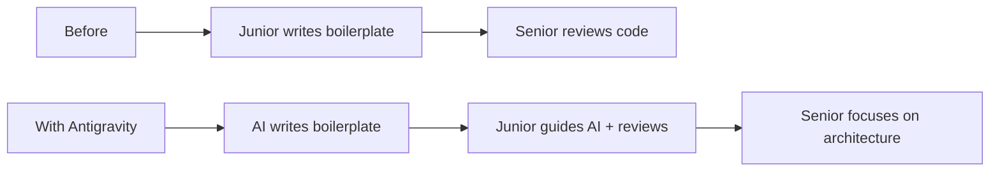

# Chapter 12: Google Antigravity - The Agentic IDE

On November 18, 2025, Google launched **Antigravity**, a revolutionary AI-powered integrated development environment (IDE) that transforms AI assistance from a helpful tool into an **active development partner**. Powered by Gemini 3, Antigravity represents the future of software development.

## 12.1 What is Google Antigravity?

Google Antigravity is an **agentic development platform** that allows AI agents to autonomously plan, execute, and verify complex software development tasks across your entire development environment.

:::tip Revolutionary Approach
Traditional coding assistants offer autocomplete or chat suggestions. **Antigravity agents** autonomously handle end-to-end tasks—writing code, running tests, debugging, and verifying output in a browser.
:::

### Key Characteristics

| Feature | Traditional IDE | Antigravity |
|---------|----------------|-------------|
| **AI Role** | Suggestion provider | Active partner |
| **Task Handling** | Line-by-line assistance | End-to-end execution |
| **Environment Access** | Limited to editor | Editor + Terminal + Browser |
| **Verification** | Manual | Automatic with artifacts |
| **Workflow** | Sequential | Parallel multi-agent |

## 12.2 Core Features

### 1. Agent-First Architecture

Antigravity's agents can:
- **Plan** complex development tasks
- **Execute** code across multiple files
- **Test** functionality in the terminal
- **Verify** results in the browser
- **Present** ready-to-review outcomes

```typescript
// Example: Agent Task
// Request: "Add a dark mode toggle to the website"

// Agent autonomously:
// 1. Analyzes current code structure
// 2. Creates new CSS variables for dark mode
// 3. Implements toggle component
// 4. Updates state management
// 5. Adds toggle to navigation
// 6. Tests in browser
// 7. Verifies accessibility
// 8. Presents working demo
```

### 2. Three-Environment Integration

#### 🖥️ Editor Access
- Read and write code across multiple files
- Understand project structure
- Navigate codebases intelligently
- Refactor with context awareness

#### ⚡ Terminal Control
- Run commands and scripts
- Execute tests and builds
- Install dependencies
- Debug runtime issues

#### 🌐 Browser Integration
- Launch development servers
- Verify UI/UX implementations
- Test responsive design
- Capture screenshots for review

### 3. Dual Interface System

#### Editor View
Traditional IDE experience with AI superpowers:
- **Tab Completions**: Context-aware code suggestions
- **Inline Commands**: Natural language instructions
- **Real-time Collaboration**: AI pair programming
- **Smart Refactoring**: Intelligent code transformations

```python
# Example: Inline command
# Type: # "optimize this database query for large datasets"

# Before
def get_users():
    return User.query.all()

# Agent transforms to:
def get_users(offset=0, limit=100):
    """Fetch users with pagination for better performance."""
    return User.query.offset(offset).limit(limit).all()
```

#### Manager Surface
Orchestration interface for complex workflows:
- **Multi-Agent Coordination**: Run multiple agents simultaneously
- **Cross-Workspace Operations**: Manage different projects
- **Task Queues**: Priority-based agent scheduling
- **Progress Monitoring**: Real-time status updates

## 12.3 Powered by Multiple AI Models

Antigravity leverages best-in-class models:

- **Gemini 3 Pro**: Primary reasoning and coding engine
- **Gemini 2.5 Computer Use**: Advanced browser control
- **Gemini 2.5 Image (Nano Banana)**: Image editing capabilities
- **Claude Sonnet 4.5**: Alternative model option
- **GPT-OSS**: Open-source model variants

:::info Model Optionality
Developers can choose the right model for each task, balancing cost, performance, and specific capabilities.
:::

## 12.4 Trust Through Artifacts

### What Are Artifacts?

To ensure transparency and build developer trust, agents generate **Artifacts**:

#### 📋 Task Lists
```markdown
**Agent Task Plan: Add Payment Integration**

✅ 1. Research Stripe API documentation
✅ 2. Install Stripe SDK dependencies
⏳ 3. Create payment endpoint
⏳ 4. Implement frontend form
⏳ 5. Add error handling
⬜ 6. Write integration tests
⬜ 7. Update documentation
```

#### 📝 Implementation Plans
Detailed breakdowns of how the agent will approach the task:
- Architecture decisions
- File changes required
- Testing strategy
- Rollback plan

#### 📸 Screenshots
Visual proof of browser-based verifications:
- UI implementation screenshots
- Responsive design tests
- Cross-browser compatibility checks

#### 🎥 Browser Recordings
Complete video recordings of agent interactions:
- User flow demonstrations
- Performance testing
- Accessibility verification

### Example Artifact Flow

```typescript
// Request: "Build a login page with OAuth"

// Generated Artifacts:
artifacts = {
  task_list: "IMPLEMENTATION_PLAN.md",
  code_changes: [
    "src/auth/LoginPage.tsx",
    "src/auth/OAuthHandler.ts",
    "src/api/authService.ts"
  ],
  screenshots: [
    "login_page_desktop.png",
    "login_page_mobile.png",
    "oauth_flow.png"
  ],
  recording: "login_implementation.webp",
  test_results: "test_output.txt"
}
```

## 12.5 Real-World Use Cases

### Use Case 1: Feature Development

**Scenario**: Add a comment system to a blog

```bash
# Developer types:
"Add a comment system with:
- User authentication
- Reply threading
- Like/dislike functionality
- Spam filtering
- Email notifications"

# Antigravity agent:
# ✅ Creates database schema
# ✅ Builds backend API endpoints
# ✅ Implements frontend components
# ✅ Adds authentication checks
# ✅ Sets up email service
# ✅ Writes comprehensive tests
# ✅ Documents API usage
# ⏱️ Time: ~10 minutes vs 4+ hours manually
```

### Use Case 2: Bug Fixing

**Scenario**: Fix a memory leak in production

```python
# Agent workflow:
analyze_error_logs()
identify_leak_source()
propose_fix()
implement_solution()
run_memory_profiling()
verify_fix()
generate_report()

# Presents:
# - Root cause analysis
# - Code fix with explanation
# - Before/after memory usage graphs
# - Test results
```

### Use Case 3: Refactoring Legacy Code

**Scenario**: Modernize a legacy codebase

```typescript
// Request: "Refactor this jQuery code to React with TypeScript"

// Agent handles:
interface RefactoringTask {
  analyze: "Understand current jQuery logic";
  plan: "Design React component architecture";
  convert: "Transform to React + TypeScript";
  test: "Ensure feature parity";
  optimize: "Apply modern best practices";
  document: "Update documentation";
}

// Output: Modern, type-safe React application
```

## 12.6 Getting Started with Antigravity

### Installation

Antigravity is available free for individuals:

```bash
# Download for your platform
# macOS
brew install google-antigravity

# Windows
winget install Google.Antigravity

# Linux
snap install google-antigravity
```

### First Steps

1. **Open Antigravity**
2. **Connect your project**
3. **Choose your AI model**
4. **Start with a simple task**

```markdown
Example First Task:
"Add a README.md file with:
- Project description
- Installation instructions
- Usage examples
- Contributing guidelines"
```

### Configuration

```json
// antigravity.config.json
{
  "defaultModel": "gemini-3-pro",
  "agentBehavior": {
    "autoTest": true,
    "browserVerification": true,
    "createArtifacts": true
  },
  "security": {
    "requireApproval": ["deployments", "database-changes"],
    "sandboxMode": true
  },
  "workspace": {
    "maxParallelAgents": 3,
    "artifactStorage": "./artifacts"
  }
}
```

## 12.7 Best Practices

### 1. Clear Task Descriptions

```markdown
❌ Bad: "Fix the app"
✅ Good: "Fix the login validation error where users with special characters in email can't log in"

❌ Bad: "Make it faster"
✅ Good: "Optimize the product listing query that takes >2 seconds with 1000+ items"
```

### 2. Review Artifacts Thoroughly

Before accepting agent work:
- Read the implementation plan
- Review code changes
- Check screenshots/recordings
- Verify test results

### 3. Iterative Refinement

```typescript
// First iteration
agent.task("Create a dashboard");
// Review output

// Refinement
agent.task("Add real-time updates to the dashboard using WebSockets");
// Review output

// Polish
agent.task("Improve dashboard accessibility and add dark mode");
```

### 4. Leverage Multi-Agent Workflows

```python
# Run parallel agents for efficiency
agents = [
    Agent("Update frontend components"),
    Agent("Optimize database queries"),
    Agent("Write API documentation"),
    Agent("Create integration tests")
]

# All work simultaneously on different aspects
parallel_execute(agents)
```

## 12.8 Impact on Development Teams

### For Junior Developers
- **Faster Learning**: See best practices in action
- **Confidence Building**: Try complex tasks with AI support
- **Skill Development**: Learn from agent-generated code

### For Senior Developers
- **Productivity Boost**: Offload routine tasks
- **Focus on Architecture**: More time for high-level decisions
- **Code Review**: AI-generated code quality checks

### For Teams
- **Faster Delivery**: Accelerated development cycles
- **Consistency**: Standardized approaches across projects
- **Documentation**: Automatic artifact generation

## 12.9 The Controversy and Future

### The Junior Developer Question

:::warning Industry Debate
Some discussions suggest Antigravity could impact junior developer roles by automating routine coding tasks. However, history shows that automation creates new opportunities while eliminating tedious work.
:::

### Evolution of Roles



### The Future Vision

- **Human-AI Collaboration**: Developers + AI agents as teams
- **Higher Abstraction**: Focus on "what" not "how"
- **Creative Problem Solving**: More time for innovation
- **Accessible Development**: Lower barriers to entry

## 12.10 Antigravity vs Other AI IDEs

| Feature | Antigravity | GitHub Copilot | Cursor AI | Windsurf |
|---------|-------------|----------------|-----------|----------|
| Autonomous Agents | ✅ Yes | ❌ No | 🟡 Partial | 🟡 Partial |
| Browser Control | ✅ Yes | ❌ No | ❌ No | ❌ No |
| Multi-Agent | ✅ Yes | ❌ No | ❌ No | ❌ No |
| Artifacts | ✅ Yes | ❌ No | ❌ No | 🟡 Partial |
| Terminal Access | ✅ Full | ❌ No | 🟡 Limited | ❌ No |
| Model Choice | ✅ Multiple | ❌ Single | 🟡 Limited | 🟡 Limited |

## Summary

Google Antigravity is revolutionizing software development:

✅ **Agent-First**: AI actively develops, not just suggests  
✅ **Full Environment**: Editor + Terminal + Browser access  
✅ **Transparent**: Artifacts build trust and understanding  
✅ **Multi-Model**: Choose the best AI for each task  
✅ **Free Access**: Available to all developers  
✅ **Team-Oriented**: Multi-agent collaboration support  

## What's Next?

In the next chapter, we'll explore **Python for AI Development** - best practices, frameworks, and patterns for building production-ready AI applications with Python.

---

**Key Takeaways:**
- Antigravity transforms AI from assistant to development partner
- Agents autonomously handle end-to-end development tasks
- Artifacts ensure transparency and trust in AI-generated work
- Multi-environment access enables complete task automation
- Free availability democratizes access to cutting-edge AI tools
- The future of development is human-AI collaboration

**Try It Yourself:**
1. Download Antigravity for your platform
2. Start with a small feature implementation
3. Review the artifacts generated
4. Iterate and refine based on results
5. Share your experience with the community
